<p align="center">
  
</p>

<p align="center">
  <a href="https://www.linkedin.com/in/benjamingray190/"></a>
  <a href="mailto:bengray190@gmail.com"></a>
  <a href="https://github.com/capo-dev/Portfolio"></a>
</p>

```console
ben@capo-dev:~$ whoami
Ben Gray. Cyber Security Engineer at Lufkin Industries.
Scottish by birth, Texan by address.

ben@capo-dev:~$ cat focus.txt
Leading IT security operations across endpoint, email, identity, and cloud.
Building a legal automation business on the side. More soon.

ben@capo-dev:~$ ls ~/learning
SC-500
```

### ~/work

- Lead day-to-day security operations: detection, response, and threat hunting
- Build automation that resolves repetitive alerts and handles reporting
- Govern how the company uses AI tools
- Harden Azure and drive vulnerability and pen test remediation
- Own identity and Conditional Access strategy.

**Lufkin Industries** &nbsp;·&nbsp; June 2024 to present<br>
Cyber Security Engineer, promoted from Security Analyst. Authored the company's incident response and disaster recovery plans, established 20+ NIST-aligned security policies, and built the vulnerability management program from the ground up.

**Log(N) Pacific** &nbsp;·&nbsp; Sept 2023 to Jan 2024<br>
Cyber Security Support Engineer. Secured Azure workloads and wrote the KQL behind five Sentinel dashboards.

### ~/projects

<a href="https://github.com/capo-dev/m365-defender-hunting">
  
</a>
<a href="https://github.com/capo-dev/SOC-Honeynet-in-Azure">
  
</a>
<a href="https://github.com/capo-dev/IR-Playbooks">
  
</a>

More in the [portfolio](https://github.com/capo-dev/Portfolio).

### ~/stack


### ~/credentials

B.S. and A.S. in Cyber Security, Lone Star College<br>
CompTIA Security+ &nbsp;·&nbsp; SentinelOne Security Suite

<p>
  
  
</p>
